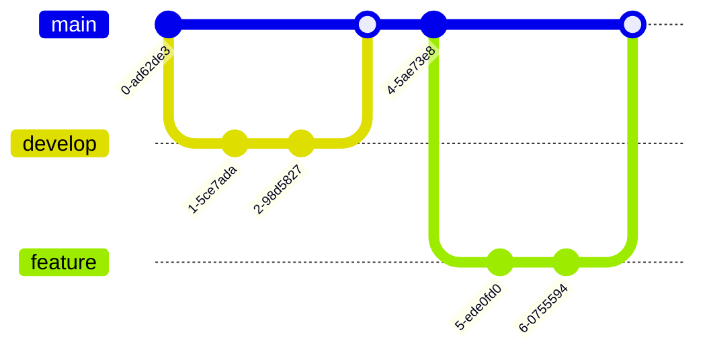

# Curso-Platzi-2026

Repositorio del curso de Platzi.

Mi primer contribución local para GitHub.

Un cambio desde GitHub.

Otro cambio desde GitHub para probar el comando "fetch".

```mermaid
gitGraph
    commit
    branch develop
    checkout develop
    commit
    commit
    checkout main
    merge develop
    commit
    branch feature
    checkout feature
    commit
    commit
    checkout main
    merge feature
```
